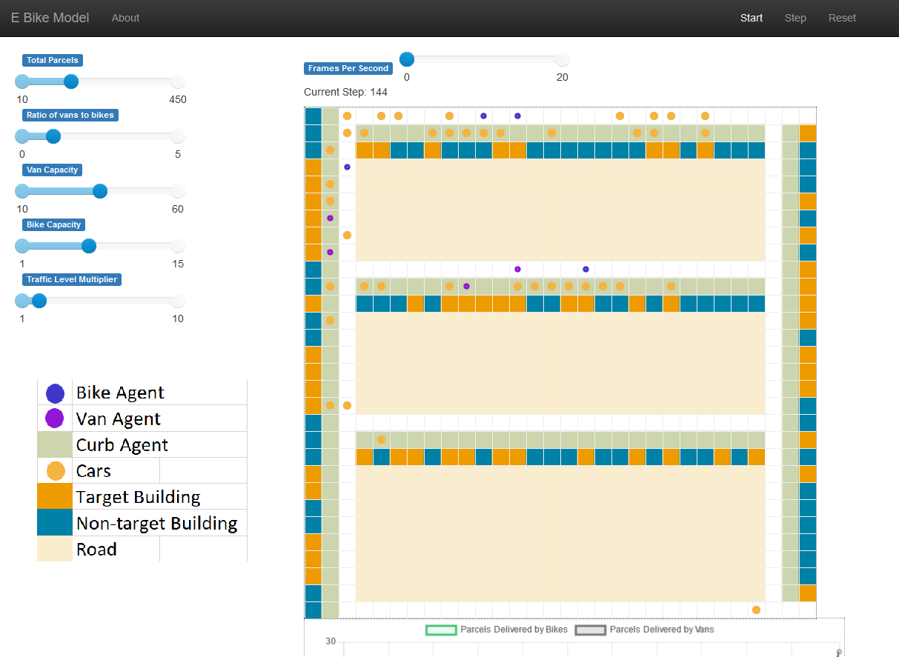
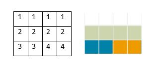

# Agent Based Simulation Model

## Model Aim

This model is built to test the logistical feasibility for electric cargo bikes to replace traditional delivery vans in high density commercial areas with narrow single lane roads.

The model is written in Python using the MESA library. By running the notebook, a new browser will appear. That is the interactive mode, there are a list of parameters adjustable in the interactive mode, users can adjust them to look at things differently. The start button is located in the top right corner.

*Trick: For the quickest step speed, set the slidebar to 0.*

Utilizing numpy's function, the environment with color codes are created from a text file containing space separated numbers that will be transformed into color codes. The text file is modifiable, simply the text file and specify the grid size in the front part of the model code.

